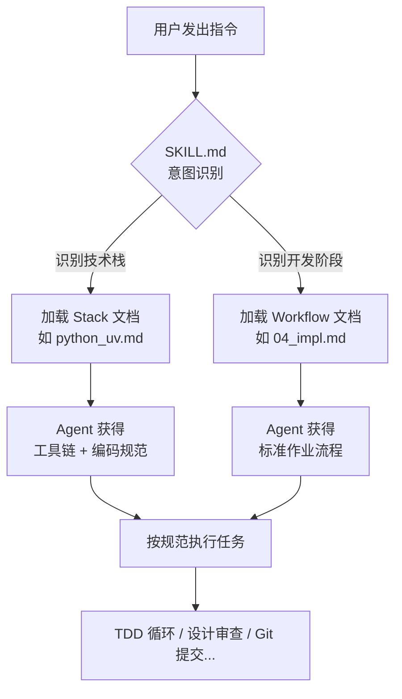

# Vibe Coding Skills

> 一套面向 AI 编程助手的软件工程规范体系，让 Agent 像资深架构师一样工作。

[](LICENSE)

## 这是什么？

Vibe Coding Skills 是一组结构化的 Markdown 文档，用于指导 AI 编程助手（如 Windsurf Cascade、Cursor 等）在软件开发全生命周期中遵循专业的工程实践。

它不是一个可执行的程序，而是一套 **"AI 的操作手册"**——通过将最佳实践编码为 Agent 可读的指令，确保 AI 生成的代码符合以下标准：

- **TDD (测试驱动开发)**：先写测试，再写实现
- **Clean Architecture**：模块化、低耦合、SOLID 原则
- **现代化工具链**：每种语言使用最快、最现代的工具（如 Python 用 `uv` + `ruff`，C++ 用 `CMake` + `Ninja`，Java 用 `Gradle` + `Spring Boot`，Flutter 用 `Riverpod` + `Freezed`，Vue 用 `Vite` + `Pinia`）
- **标准化流程**：从需求分析到 CI/CD 交付的完整工作流

## 目录结构

```text
.
├── SKILL.md                # 入口文件：Agent 的主控指令和动态路由协议
├── core/                   # 通用原则（语言无关）
│   ├── general.md          #   SOLID, DRY, KISS, 错误处理
│   ├── git_flow.md         #   Git Flow, SemVer, Conventional Commits
│   └── testing_standard.md #   TDD 工作流, 测试金字塔, 覆盖率要求
├── workflow/               # 标准作业程序（开发阶段）
│   ├── 00_init.md          #   项目初始化
│   ├── 01_analysis.md      #   需求分析与决策记录 (ADR)
│   ├── 02_design.md        #   接口设计与骨架搭建
│   ├── 03_progress.md      #   进度管理与任务追踪
│   ├── 04_impl.md          #   TDD 实现流程
│   └── 05_delivery.md      #   CI/CD 与交付
└── stacks/                 # 语言与工具链适配
    ├── python_uv.md        #   Python (uv + ruff + mypy + pytest)
    ├── cpp_cmake.md        #   C++ (CMake + Conan + Ninja + GTest)
    ├── java_springboot.md  #   Java (Spring Boot + Spring Cloud + Gradle + JUnit 5)
    ├── dart_flutter.md     #   Dart/Flutter (Flutter + Riverpod + GoRouter + Freezed)
    └── ts_vue.md           #   TypeScript/Vue (Vite + Vue 3 + Pinia + Vitest)
```

## 快速开始

### 在 Windsurf 中使用

将本项目克隆或复制到你的目标项目中，重命名为 `.windsurf/skills/`：

```bash
# 在你的项目根目录下
git clone https://github.com/bigcat26/vibe-coding-skills.git .windsurf/skills/vibe-coding
```

Windsurf Cascade 会自动识别并加载 `SKILL.md` 作为技能指令。

### 在其他 AI IDE 中使用

将本项目放置到 AI IDE 能够读取的配置目录中（具体路径因 IDE 而异），确保 `SKILL.md` 可被 Agent 访问。

## 工作原理



1. **`SKILL.md`** 作为入口，定义 Agent 的角色和动态路由协议
2. Agent 根据用户意图，自动加载对应的 **Stack**（工具链）和 **Workflow**（流程）文档
3. **`core/`** 中的通用原则始终生效，作为所有决策的底线

## 扩展

### 添加新的语言支持

在 `stacks/` 目录下创建新文件（如 `ts_bun.md`），参考 `python_uv.md` 的结构，包含以下章节：

1. 工具链标准
2. 项目结构 (Layout)
3. 初始化工作流
4. 配置标准
5. 开发指令集
6. 编码规范
7. 错误处理

然后在 `SKILL.md` 的路由表和文件索引中注册新文件。

### 添加新的工作流阶段

在 `workflow/` 目录下创建新文件（如 `06_monitoring.md`），同样需要在 `SKILL.md` 中注册。

## 许可证

本项目采用 [Apache License 2.0](LICENSE) 许可证。

## 作者

bigcat26 — [https://github.com/bigcat26](https://github.com/bigcat26)
