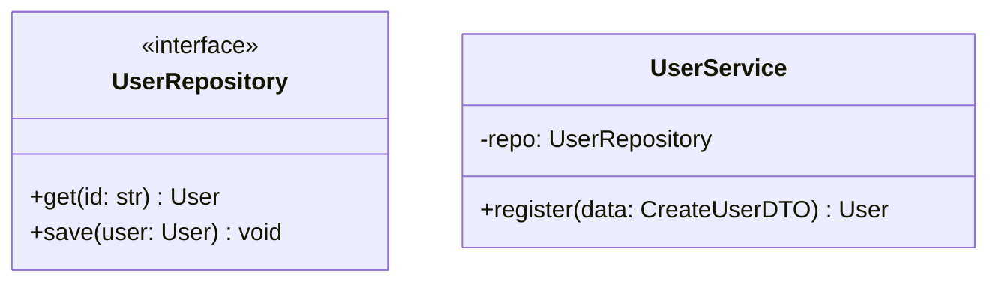

# 设计与骨架搭建工作流

本文档定义了 Vibe Coding 体系下的设计阶段标准。Agent 在进入 Implementation (实现) 阶段之前，必须先通过设计审查。

## 核心原则：接口优先 (Interface First)

Agent 必须坚持“面向接口编程，而非面向实现编程”。

*   **解耦**：高层模块不应依赖低层模块的具体实现。
*   **契约**：在写代码前，先定义模块之间的交互契约 (Contract)。
*   **可视化**：复杂的逻辑必须先画图，后写代码。

## 标准执行步骤

### 步骤一：领域建模 (Domain Modeling)

*   识别核心业务实体 (Entities) 和值对象 (Value Objects)。
*   定义数据模型 (Schemas/Models)。
    *   根据技术栈选择工具 (如 Python 的 Pydantic, TypeScript 的 Interface, C++ 的 Struct)。
    *   明确字段类型、校验规则和必填项。

### 步骤二：接口定义 (Interface Definition)

*   定义服务层 (Service Layer) 和数据访问层 (Repository Layer) 的接口。
*   使用抽象语法结构：
    *   **Python**: `Protocol` (推荐) 或 `ABC`。
    *   **TypeScript**: `interface`。
    *   **C++**: 纯虚类 (Pure Virtual Class) 或头文件。
    *   **Go**: `interface`。
*   明确输入参数类型和返回值类型 (Type Hints)。

### 步骤三：架构可视化 (Visual Architecture)

Agent 必须使用 Mermaid 语法生成图表，以辅助用户理解设计方案。

*   **类图 (Class Diagram)**：展示类之间的继承、组合和依赖关系。
*   **时序图 (Sequence Diagram)**：展示关键业务流程 (如“下单”、“登录”) 的对象交互顺序。
*   **状态图 (State Diagram)**：展示复杂对象 (如“订单状态”) 的生命周期流转。

### 步骤四：骨架代码生成 (Skeleton Generation)

*   根据设计生成项目文件结构。
*   生成“空实现” (Stubs) 文件：
    *   包含所有的类、函数定义。
    *   包含完整的 Type Hints 和 Docstrings。
    *   函数体留空 (如 Python 的 `pass` 或 `...`)，或抛出 `NotImplementedError`。
*   **验证**：此时代码应该是可编译/可解析的，但无法运行业务逻辑。

## Agent 交互协议

### 审查机制

在生成骨架代码之前，Agent 必须向用户输出设计方案并寻求确认。设计方案应包含：

*   Mermaid 图表。
*   核心接口的代码片段。
*   关键数据模型的定义。

### 迭代修正

*   如果用户对设计提出修改意见，Agent 必须更新 Mermaid 图表和接口定义，再次请求确认。
*   严禁在用户未确认设计的情况下直接编写实现代码。

### 示例输出格式

当用户请求设计一个“用户系统”时，Agent 应输出：

*   **Mermaid Class Diagram**:



*   **Python Skeleton**:
```python
class UserRepository(Protocol):
    def get(self, user_id: str) -> User: ...
    def save(self, user: User) -> None: ...
```